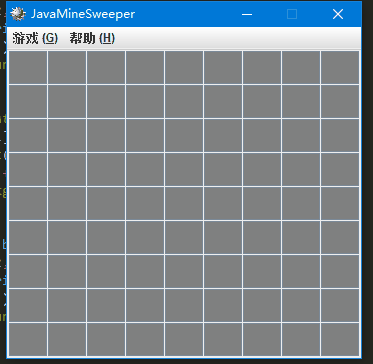

# javaMineGame
本项目为2017年《面相对象程序设计课程》的课程设计

## 基本操作

程序设计仿照windows xp经典的扫雷游戏制作，鼠标左键单击即可开始游戏，当点击空白块时将向用户展示提示数字或开启连续的空白块
双击数字可以根据已知情况快速开启安全的区域，当标记全部地雷或点开了全部都安全区域后，游戏将提示用户扫雷成功，并给出扫雷花费的时间。

## 游戏功能

当一局游戏未结束时可随时通过菜单按钮重新开局。同时菜单中还可以设置游戏难度，默认提供了初级、中级、高级的难度，分别是9*9、16*16、22*22，雷数分别是10、40、99，除此之外游戏还允许通过手动输入宽度和雷数自定义游戏难度。

当用户踩中地雷后，游戏结束并给出用户失败的提示，确认点击后将重新开始新的一局游戏。

